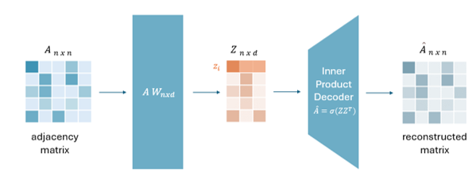
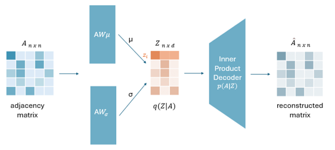

# Linear GAE e Linear GVAE: analisi di sensitività e estesnsione all'Anomaly Detection 

Questo progetto si concentra sull'analisi dei risultati presentati nel paper “Simple and Effective Graph Autoencoders with One-Hop Linear Models” di Guillaume Salha, Romain Hennequin e Michalis Vazirgiannis. Gli autori propongono una versione lineare dei modelli di Graph Autoencoders (GAE) e Graph Variational Autoencoders (GVAE), focalizzandosi su soluzioni più semplici ed efficienti rispetto agli approcci tradizionali. Nel contesto di questo progetto, ho replicato e approfondito i risultati del paper, concentrandomi sull'analisi di sensitività dei modelli lineari proposti e estendendo i modelli al task di Anomaly Detection.

  

## Analisi di Sensitività
L'analisi di sensitività ha lo scopo di comprendere come le variazioni nei parametri di input influenzano le prestazioni dei modelli. L’analisi ha preso in esame sia parametri generali dei modelli, sia aspetti più specifici legati ai singoli task. Questa analisi è stata condotta su due task principali: Link Prediction e Node Clustering. 

#### Link Prediction
Nel task di link prediction, ho esaminato l’effetto del numero di link rimossi. I risultati mostrano che l'accuratezza dei modelli diminuisce con l'aumento della percentuale di link rimossi, suggerendo che i modelli lineari potrebbero avere limitazioni nel gestire dati più rumorosi.

#### Node Clustering
Nel task di node clustering, sono stati testati diversi algoritmi di clustering (K-Means, DBSCAN e Clustering Agglomerativo). I risultati mostrano che la scelta dell'algoritmo di clustering può influenzare significativamente le prestazioni dei modelli lineari, con performance variabili a seconda del dataset.

## Anomaly Detection
Oltre all’analisi di sensitività, il progetto ha esplorato l’estensione dei modelli lineari proposti nel paper originale al task di anomaly detection su grafi. L'obiettivo è stato adattare i modelli – inizialmente pensati per operare su un singolo grafo – per poter lavorare su insiemi di grafi etichettati come normali o anomali.  

Due dataset sono stati utilizzati per la valutazione: AIDS e IMDB-BINARY. In entrambi i dataset, i modelli lineari non si sono rivelati molto efficaci nel task di anomaly detection. Nonostante performance globalmente subottimali, hanno mostrato in più casi risultati comparabili o superiori ai modelli GCN, suggerendo un buon potenziale.